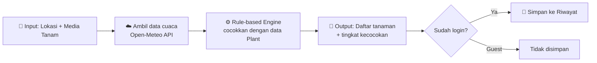

# 🌱 NANEM

**Rekomendasi tanaman berdasarkan kondisi cuaca & media tanam kamu.**

🌐 [**Live Demo (PWS)**](https://jihan-nabiilah-nanem.pws.cs.ui.ac.id/) &nbsp;|&nbsp; 🎨 [**Desain Figma (Low-Fi)**](https://www.figma.com/design/AwgBPy0JQrH6tXT4aN79Io/Main-Figma?node-id=0-1&p=f&t=HVUroBjAaXXzQvnn-0)

---

## 📑 Daftar Isi

- [👥 Anggota Tim](#-anggota-tim)
- [📖 Deskripsi Aplikasi](#-deskripsi-aplikasi)
- [🔍 Benchmarking](#-benchmarking)
- [🧩 Daftar Modul & PIC](#-daftar-modul--pic)
- [🗄️ Daftar Model & PIC](#️-daftar-model--pic)
- [🔌 Eksternal API](#-eksternal-api)
- [🔐 User Role](#-user-role)
- [🔗 Tautan Penting](#-tautan-penting)

---

## 👥 Anggota Tim

| No  | Nama                          | NPM        |
| :-: | ----------------------------- | ---------- |
|  1  | Jihan Nabiilah Permata Sukma  | 2506549026 |
|  2  | Muhammad Hafidz Muazzam       | 2506621812 |
|  3  | Zhafira Richas                | 2506540941 |
|  4  | Muhammad Eshan Bobby Bhaskara | 2506546333 |
|  5  | Johannes Nichola Simatupang   | 2406495930 |

---

## 📖 Deskripsi Aplikasi

**NANEM** adalah aplikasi yang memberikan **rekomendasi tanaman berdasarkan kondisi cuaca di lokasi pengguna**, dengan mempertimbangkan media tanam yang dipakai (tanah atau hidroponik). Dengan begitu, pengguna bisa tahu tanaman apa yang cocok ditanam tanpa harus menebak-nebak.

### 🎯 Siapa pelanggannya?

- 🌿 Masyarakat yang ingin mulai bercocok tanam
- 🏡 Pemilik lahan skala kecil
- 🔰 Pemula yang belum tahu tanaman apa yang cocok dengan kondisi lingkungannya
- 🏙️ Pengguna urban farming dengan media tanam terbatas, termasuk hidroponik

### 💡 Solusi yang ditawarkan

Pengguna cukup memasukkan:

| Input              | Keterangan                         |
| ------------------ | ---------------------------------- |
| 📍 **Lokasi**      | Latitude & longitude               |
| 🪴 **Media tanam** | Tanah atau hidroponik (media lain) |

Setelah itu sistem akan:

1. Mengambil data **suhu, kelembapan, dan curah hujan** dari koordinat tersebut lewat **Open-Meteo API**.
2. Mencocokkan data cuaca dan media tanam dengan karakteristik tanaman di database menggunakan **rule-based recommendation engine** (bukan machine learning).
3. Menampilkan daftar tanaman beserta **tingkat kecocokan** dan informasi kebutuhannya.

### ✨ Manfaat

- ✅ Menentukan tanaman yang sesuai dengan kondisi cuaca setempat
- ✅ Mengurangi risiko salah pilih tanaman
- ✅ Memudahkan akses informasi kebutuhan tanaman
- ✅ Membantu pemanfaatan lahan yang lebih optimal
- ✅ Meningkatkan pemahaman hubungan antara kondisi lingkungan dan pertumbuhan tanaman

### 🏆 Kenapa NANEM lebih baik?

NANEM menggabungkan **data kondisi lingkungan** dan **rekomendasi tanaman** dalam satu aplikasi. Pengguna tidak perlu mencari informasi tiap tanaman secara terpisah. Keunggulan lebih lanjut akan divalidasi lewat benchmarking di bawah.

### ⏰ Kenapa harus sekarang?

Lahan semakin terbatas dan kondisi lingkungan terus berubah, sementara teknologi sudah memungkinkan data cuaca dan informasi tanaman dimanfaatkan untuk membantu pengguna memilih tanaman yang tepat.

---

## 🔍 Benchmarking

| Aplikasi     | Fokus Utama                           | Kelebihan                                 | Keterbatasan                                             |
| ------------ | ------------------------------------- | ----------------------------------------- | -------------------------------------------------------- |
| **Plantix**  | Deteksi penyakit tanaman lewat foto   | Komunitas petani aktif, forum tanya-jawab | Fokus diagnosa penyakit, bukan rekomendasi jenis tanaman |
| **PlantNet** | Identifikasi tanaman lewat foto       | Database spesies luas, akurasi tinggi     | Tidak ada rekomendasi berdasarkan kondisi lingkungan     |
| **Planta**   | Perawatan tanaman hias                | UI/UX rapi, jadwal perawatan personal     | Untuk tanaman hias rumahan, bukan kebun/lahan pertanian  |
| **CropIn**   | Manajemen lahan pertanian skala besar | Analitik data satelit & prediksi panen    | Kompleks, ditujukan untuk petani profesional             |

> 📌 **Kesimpulan:** Kombinasi _"input lokasi & media tanam → rekomendasi tanaman berbasis cuaca"_ masih jarang jadi fitur utama di aplikasi yang ada. Ini jadi peluang diferensiasi NANEM untuk pengguna pemula dan pemilik lahan skala kecil dengan alur yang lebih sederhana.

---

## 🧩 Daftar Modul & PIC

|  #  | Modul                                 | PIC          |
| :-: | ------------------------------------- | ------------ |
|  1  | 🔐 Autentikasi, Rekomendasi & Riwayat | **Jihan**    |
|  2  | 👤 Profil Pengguna                    | **Hafidz**   |
|  3  | 📔 Koleksi Tanaman                    | **Zhafira**  |
|  4  | 📚 Katalog Tanaman                    | **Bobby**    |
|  5  | 🧑‍🌾 Panduan Budidaya                   | **Nicholas** |

### 1️⃣ Autentikasi, Rekomendasi & Riwayat — _Jihan_

Mengelola autentikasi (register, login, logout), sistem rekomendasi tanaman berbasis rule-based dengan data cuaca dari Open-Meteo, dan riwayat rekomendasi pengguna.

**Alur rekomendasi**

| Tahap          | Detail                                                                                                               |
| -------------- | -------------------------------------------------------------------------------------------------------------------- |
| 📥 **Input**   | Lokasi (latitude & longitude) dan media tanam (tanah / hidroponik / lainnya)                                         |
| ⚙️ **Proses**  | Ambil suhu, kelembapan, curah hujan dari Open-Meteo, lalu cocokkan dengan data `Plant` dan media tanam yang didukung |
| 📤 **Output**  | Daftar tanaman rekomendasi + skor kecocokan + alasan singkat (faktor cuaca mana yang cocok / kurang cocok)           |
| 💾 **Riwayat** | Khusus user login: hasil disimpan sebagai snapshot (input, data cuaca saat itu, dan daftar rekomendasi)              |

**CRUD**

| Operasi   | Deskripsi                                                                                     |
| --------- | --------------------------------------------------------------------------------------------- |
| ➕ Create | Generate rekomendasi dari input lokasi & media tanam, hasil disimpan sebagai snapshot riwayat |
| 👁️ Read   | Melihat daftar riwayat dan detail satu riwayat                                                |
| ✏️ Update | Mengubah nama lahan pada riwayat (hasil rekomendasi tidak bisa diubah manual)                 |
| 🗑️ Delete | Menghapus riwayat rekomendasi                                                                 |

### 2️⃣ Profil Pengguna — _Hafidz_

Mengelola data profil yang terhubung dengan akun Django (`User`).

| Operasi   | Deskripsi                                            |
| --------- | ---------------------------------------------------- |
| ➕ Create | Profil dibuat otomatis saat registrasi               |
| 👁️ Read   | Melihat profil sendiri maupun profil pengguna lain   |
| ✏️ Update | Mengubah nama, username, foto profil, dan kata sandi |
| 🗑️ Delete | Menghapus akun                                       |

### 3️⃣ Koleksi Tanaman — _Zhafira_

Jurnal pribadi untuk mendokumentasikan tanaman yang dimiliki atau ditanam pengguna.

| Operasi   | Deskripsi                                               |
| --------- | ------------------------------------------------------- |
| ➕ Create | Menambah tanaman ke koleksi (foto, judul, deskripsi)    |
| 👁️ Read   | Melihat koleksi milik sendiri                           |
| ✏️ Update | Mengubah judul dan deskripsi (foto tidak dapat diganti) |
| 🗑️ Delete | Menghapus tanaman dari koleksi                          |

### 4️⃣ Katalog Tanaman — _Bobby_

Master data tanaman yang dipakai bersama oleh modul Rekomendasi, Koleksi Tanaman, dan Panduan Budidaya.

| Operasi   | Deskripsi                                                                                                            |
| --------- | -------------------------------------------------------------------------------------------------------------------- |
| ➕ Create | Admin menambah tanaman baru (nama, rentang suhu, kelembapan, curah hujan ideal, media tanam yang cocok, gambar, dll) |
| 👁️ Read   | User melihat, mencari, dan memfilter katalog; admin melihat seluruh data                                             |
| ✏️ Update | Admin memperbarui data tanaman                                                                                       |
| 🗑️ Delete | Admin menghapus tanaman dari katalog                                                                                 |

### 5️⃣ Panduan Budidaya — _Nicholas_

Informasi praktis cara membudidayakan tanaman: cara menanam, media tanam, kebutuhan air, frekuensi penyiraman, kebutuhan cahaya, pemupukan, dan waktu panen.

| Operasi   | Deskripsi                                           |
| --------- | --------------------------------------------------- |
| ➕ Create | Admin menambah panduan budidaya untuk suatu tanaman |
| 👁️ Read   | User melihat dan memfilter panduan budidaya         |
| ✏️ Update | Admin memperbarui panduan                           |
| 🗑️ Delete | Admin menghapus panduan                             |

> 📝 **Catatan**
>
> - Modul **Katalog Tanaman** dan **Panduan Budidaya** tetap dua modul terpisah dengan ownership berbeda, meskipun di sisi pengguna keduanya tampil sebagai satu halaman _Plant Detail_.
> - CRUD Admin untuk kedua modul tersebut dibuat dengan **Views, Template, dan Form khusus**, bukan Django Admin bawaan, agar memenuhi definisi modul pada ketentuan tugas.
> - Setiap modul dikembangkan pada **branch Git terpisah** sesuai PIC masing-masing.

---

## 🗄️ Daftar Model & PIC

| Model                   | Deskripsi                                                                                                                          | PIC      |
| ----------------------- | ---------------------------------------------------------------------------------------------------------------------------------- | -------- |
| `User`                  | Model bawaan Django untuk autentikasi (username, password)                                                                         | Jihan    |
| `UserProfile`           | Data profil tambahan (nama, foto profil), relasi 1:1 dengan `User`                                                                 | Hafidz   |
| `Plant`                 | Data master tanaman (nama, nama ilmiah, deskripsi, gambar, rentang suhu/kelembapan/curah hujan ideal, media tanam yang cocok, dll) | Bobby    |
| `CultivationGuide`      | Panduan budidaya tanaman, relasi 1:1 dengan `Plant`                                                                                | Nicholas |
| `PlantCollection`       | Koleksi tanaman pribadi pengguna (foto, judul, deskripsi)                                                                          | Zhafira  |
| `RecommendationHistory` | Snapshot hasil rekomendasi (input, data cuaca, hasil)                                                                              | Jihan    |

> ⚠️ Model dan PIC masih dapat disesuaikan dengan kebutuhan implementasi.

---

## 🔌 Eksternal API

| API                                                 | Fungsi                                                                                        |    API Key     |
| --------------------------------------------------- | --------------------------------------------------------------------------------------------- | :------------: |
| ☁️ **[Open-Meteo](https://open-meteo.com/en/docs)** | Data suhu, kelembapan, dan curah hujan berdasarkan koordinat, sebagai input rule-based engine | ❌ Tidak perlu |
| 🌿 **[Perenual](https://perenual.com/docs/api)**    | Sumber data awal (seed) katalog tanaman: sunlight, watering, dimensions                       |    ✅ Perlu    |

**Catatan Perenual:** data diambil **satu kali** untuk mengisi database lokal, tidak dipanggil di setiap request. Ini mengikuti batasan free tier (3.000 spesies pertama, 100 request/hari).

**Mock API:** tidak diperlukan untuk saat ini karena kebutuhan data tanaman sudah terpenuhi lewat seed dari Perenual.

> ⚠️ External API dapat berubah sesuai ketersediaan dan feasibility implementasi.

---

## 🔐 User Role

| Fitur                                |      👻 Guest       |      👤 User       | 🛡️ Admin |
| ------------------------------------ | :-----------------: | :----------------: | :------: |
| Rekomendasi Tanaman                  | ✅ (tidak disimpan) | ✅ (bisa disimpan) |    ✅    |
| Lihat, cari & filter Katalog Tanaman |         ❌          |         ✅         |    ✅    |
| Detail Tanaman + Panduan Budidaya    |         ❌          |         ✅         |    ✅    |
| CRUD Riwayat Rekomendasi\*           |         ❌          |         ✅         |    ✅    |
| CRUD Profil Pengguna                 |         ❌          |         ✅         |    ✅    |
| CRUD Koleksi Tanaman                 |         ❌          |         ✅         |    ✅    |
| CRUD Katalog Tanaman                 |         ❌          |         ❌         |    ✅    |
| CRUD Panduan Budidaya                |         ❌          |         ❌         |    ✅    |

\* Hasil rekomendasi tidak dapat diubah manual.

**🎯 Target utama:** pemilik lahan skala kecil, masyarakat yang ingin mulai bercocok tanam, dan pemula yang belum tahu tanaman apa yang cocok dengan kondisi lingkungannya.

---

## 🔗 Tautan Penting

|                       | Tautan                                                                                                            |
| --------------------- | ----------------------------------------------------------------------------------------------------------------- |
| 🚀 **Deployment PWS** | https://jihan-nabiilah-nanem.pws.cs.ui.ac.id/                                                                     |
| 🎨 **Figma (Low-Fi)** | [Buka Figma](https://www.figma.com/design/AwgBPy0JQrH6tXT4aN79Io/Main-Figma?node-id=0-1&p=f&t=HVUroBjAaXXzQvnn-0) |
